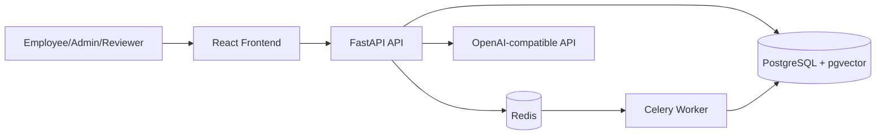

# Enterprise RAG Governance Platform

Production-oriented portfolio project for a cloud-native Retrieval-Augmented Generation platform with enterprise security and governance controls.

## Phase 1 Status

This first phase includes the repository structure, Docker Compose, FastAPI backend, React TypeScript frontend, PostgreSQL, Redis/Celery worker wiring, JWT authentication, role-based access control, database models, Alembic migration, and admin document upload.

Later phases add extraction, chunking, embeddings, vector retrieval, citation-grounded answers, PII detection, review queues, evaluation, cost tracking, and observability.

## Business Problem

Enterprises need AI assistants that answer from internal knowledge without bypassing access controls, leaking restricted content, or making unsupported claims. This platform is designed as a governed RAG reference architecture for secure document ingestion, controlled retrieval, auditable answers, and compliance review.

## Architecture



## Key Features In Phase 1

- JWT login and registration
- RBAC roles: `admin`, `user`, `reviewer`
- Admin-only document upload
- Document metadata: classification, department, access group, version, ingestion status
- PostgreSQL schema for all core Phase 1 and future governance entities
- Redis/Celery worker skeleton for asynchronous ingestion
- React dashboard, document library, upload page, chat placeholder, governance placeholder
- Alembic migration and Docker Compose runtime

## Local Setup

1. Optionally create a local env file for overrides:

```bash
cp .env.example .env
```

2. Start the platform:

```bash
docker compose up --build
```

3. Open:

- Frontend: http://localhost:5173
- Backend API: http://localhost:8000
- OpenAPI docs: http://localhost:8000/docs

## Demo Credentials

- Email: `admin@example.com`
- Password: `AdminPass123!`

## API Surface In Phase 1

- `POST /api/v1/auth/register`
- `POST /api/v1/auth/login`
- `GET /api/v1/users/me`
- `GET /api/v1/users`
- `PATCH /api/v1/users/{user_id}/role`
- `GET /api/v1/documents`
- `POST /api/v1/documents/upload`
- `GET /api/v1/health`

## Testing Commands

```bash
docker compose run --rm backend pytest
docker compose run --rm frontend npm run build
```

## Roadmap

- Phase 2: extraction, chunking, embeddings, vector search, answer generation, citations
- Phase 3: audit APIs, PII detection, prompt injection guardrails, review queue
- Phase 4: evaluation framework, cost analytics, observability dashboards
- Phase 5: polished documentation, CI/CD, Terraform and Kubernetes deployment skeleton

## Resume Bullets

- Designed a cloud-native Enterprise RAG platform with RBAC, audit logging foundations, governed document ingestion, and citation-ready data models.
- Built a FastAPI and React TypeScript application with Docker Compose, PostgreSQL, Redis, Celery, Alembic migrations, and JWT security.
- Modeled enterprise AI governance entities including review items, PII findings, risk register, evaluation results, retrieved contexts, and model usage costs.
- Implemented admin-only document upload with metadata classification, access-group tagging, upload validation, and asynchronous ingestion job tracking.
- Created architecture-first documentation and a phased roadmap for vector retrieval, grounded generation, compliance review, cost tracking, and observability.
