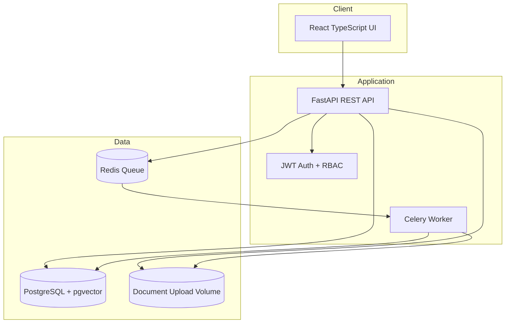

# Architecture

```mermaid
flowchart TB
  subgraph Client
    FE[React TypeScript UI]
  end
  subgraph Application
    API[FastAPI REST API]
    RBAC[JWT Auth + RBAC]
    Worker[Celery Worker]
  end
  subgraph Data
    PG[(PostgreSQL + pgvector)]
    Redis[(Redis Queue)]
    Files[(Document Upload Volume)]
  end
  FE --> API
  API --> RBAC
  API --> PG
  API --> Redis
  API --> Files
  Redis --> Worker
  Worker --> Files
  Worker --> PG
```

Phase 1 establishes the runtime foundation and data model. Phase 2 adds extraction, chunking, embeddings, and vector retrieval.
