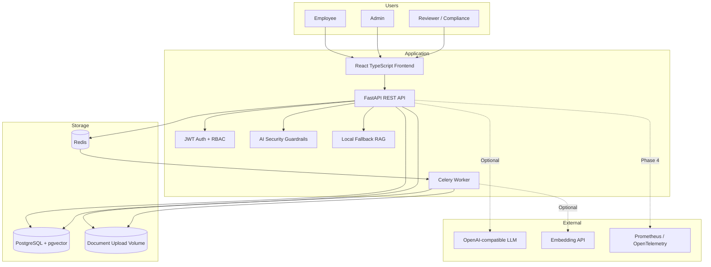
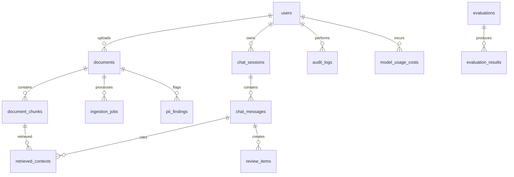

# Architecture

The Enterprise RAG Governance Platform is designed as a cloud-native reference architecture for controlled document ingestion, retrieval, answer generation, and governance evidence collection.

## System Context

## Module Boundaries

- Frontend: role-aware user interface, upload forms, chat experience, audit logs, evaluation, review queue, risk register, settings, and dashboard surfaces. Some pages use demo fallbacks when optional backend analytics endpoints are not yet available.
- API: authentication, authorization, request validation, document APIs, local chat API, audit APIs, review queue APIs, evaluation scoring, governance APIs, and settings roadmap.
- Worker: asynchronous ingestion, extraction, chunking, local hashing embeddings, PII scans, and retry/error tracking.
- Database: application state, governance records, document metadata, chunks, vector embeddings, audit logs, cost records, and evaluation outputs.
- Observability: metrics, logs, trace IDs, latency, ingestion failures, blocked prompts, and estimated LLM cost.

## Data Model Overview

## Request Lifecycle

1. A user authenticates and receives a JWT.
2. API dependencies load the current user and enforce endpoint-level RBAC.
3. Document actions store metadata and create ingestion jobs.
4. Worker jobs update ingestion status, extract text, create chunks, run simple PII detection, and write local hashing embeddings.
5. Chat requests apply access filters before retrieval.
6. The local fallback chat service builds extractive grounded answers from allowed context and writes audit/governance/cost records.

## Scalability Notes

- FastAPI instances are stateless and can scale horizontally behind a load balancer.
- Celery workers can scale independently for ingestion throughput.
- PostgreSQL can be upgraded with managed backups, read replicas, and pgvector indexes.
- Redis is used as queue infrastructure, not as the system of record.
- Object storage can replace the local upload volume in cloud deployment.

## Phase Boundaries

- Current local runtime: runtime skeleton, database models, auth/RBAC, document upload, extraction/chunking, local hashing embeddings, fallback retrieval/chat, simple PII detection, prompt guardrails, review queue, audit logs, and evaluation scoring endpoint.
- Future provider mode: replace local extractive generation and hashing embeddings with OpenAI-compatible chat/embedding providers.
- Future analytics mode: richer cost analytics, observability, and dashboard APIs.
- Phase 5: deployment hardening, CI/CD expansion, full documentation polish.
