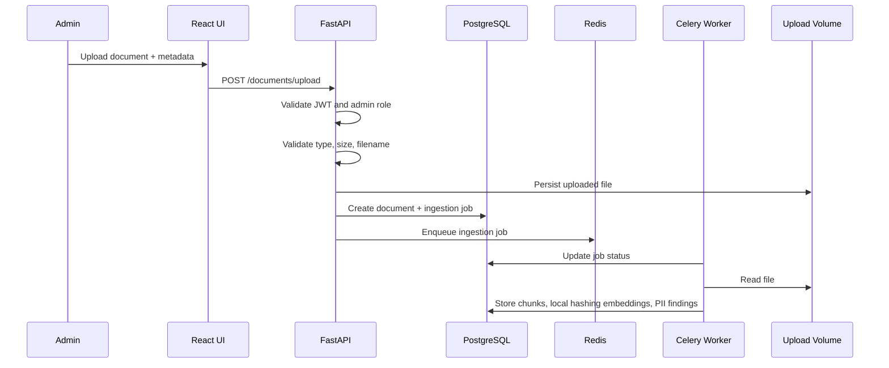
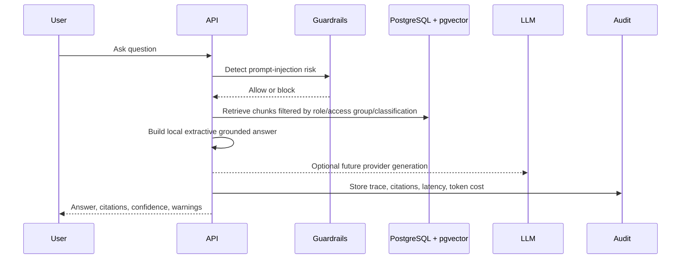
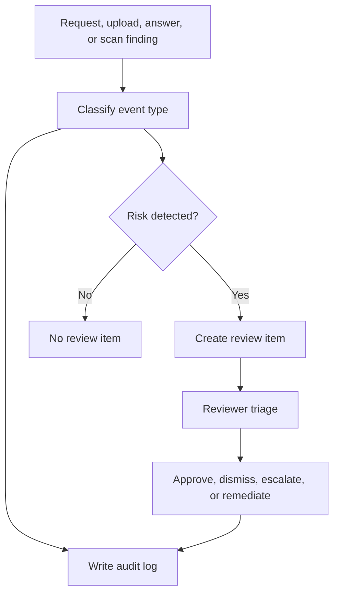

# Data Flow

This document captures the implemented local flows and future provider-facing flows for document ingestion, question answering, audit logging, and governance review.

## Document Ingestion Flow

## Retrieval And Answer Flow

## Governance Event Flow

## Data Retention Considerations

- Uploaded documents should have configurable retention and deletion workflows.
- Audit logs should be immutable or append-only in production deployments.
- Retrieved contexts should be retained long enough to support answer traceability.
- PII findings should store minimal evidence and avoid duplicating sensitive content.
- Evaluation outputs should identify dataset version and model configuration.
