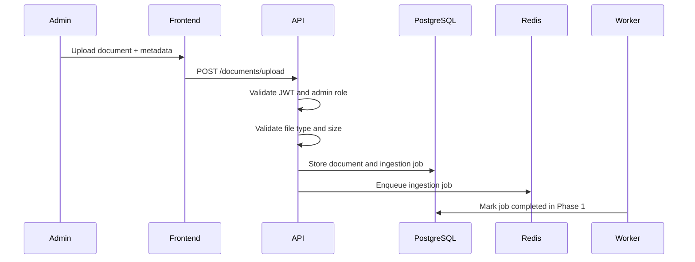

# Data Flow

```mermaid
sequenceDiagram
  participant Admin
  participant Frontend
  participant API
  participant DB as PostgreSQL
  participant Queue as Redis
  participant Worker

  Admin->>Frontend: Upload document + metadata
  Frontend->>API: POST /documents/upload
  API->>API: Validate JWT and admin role
  API->>API: Validate file type and size
  API->>DB: Store document and ingestion job
  API->>Queue: Enqueue ingestion job
  Worker->>DB: Mark job completed in Phase 1
```
