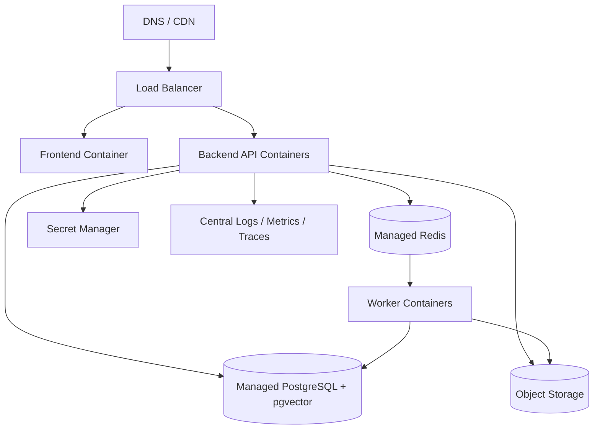

# Deployment

## Local Docker Compose

The local stack is the canonical Phase 1 deployment.

```bash
cp .env.example .env
docker compose up --build
```

Services:

- `frontend`: React/Vite UI on port `5173`.
- `backend`: FastAPI API on port `8000`.
- `postgres`: PostgreSQL with pgvector image on port `5432`.
- `redis`: Redis queue on port `6379`.
- `worker`: Celery worker for ingestion jobs.

Docker is required for the full stack. The backend depends on PostgreSQL and Redis, and ingestion requires the worker.

## Frontend-Only Mode

When Docker is unavailable, the UI can be inspected by running Vite directly:

```bash
cd frontend
npm install
npm run dev
```

Open http://localhost:5173. Some governance pages use frontend demo fallbacks when optional API endpoints are not available, but live login, upload, ingestion, chat, audit, and review workflows require the full stack.

For local startup issues, see `docs/local-development-troubleshooting.md`.

## Local Verification

```bash
docker compose ps
docker compose logs -f backend
docker compose run --rm backend pytest
docker compose run --rm frontend npm run build
```

## Production Deployment Shape



## Terraform Skeleton

`infra/terraform/` documents the planned cloud resources:

- Container runtime or Kubernetes cluster.
- Managed PostgreSQL.
- Managed Redis.
- Object storage for uploaded documents.
- Secret manager.
- Observability workspace.

## Kubernetes Skeleton

`infra/kubernetes/` documents intended manifests:

- Backend Deployment and Service.
- Worker Deployment.
- Frontend Deployment and Service.
- ConfigMap and Secret references.
- Ingress.
- Horizontal Pod Autoscaler.

## Hardening Checklist

- Replace local JWT secret.
- Use managed secrets.
- Enable TLS.
- Configure CORS for production origins only.
- Add database backups and restore drills.
- Add object storage encryption and retention.
- Add structured logs and traces.
- Configure security headers at ingress/proxy layer.
- Run migrations during deployment.
