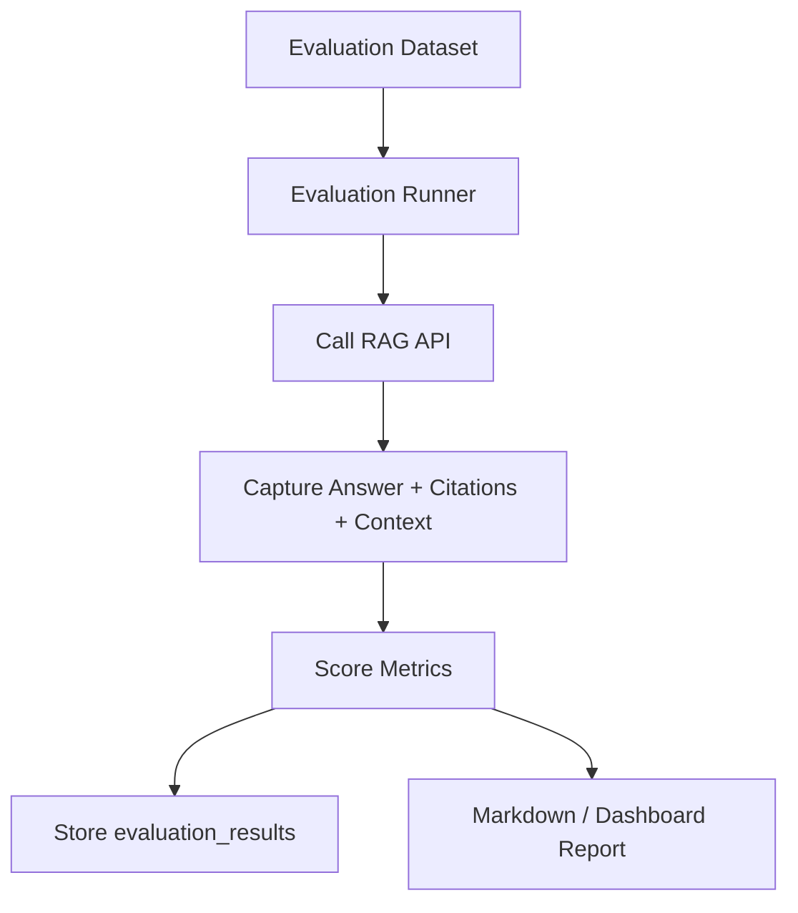

# Evaluation

The repository includes a lightweight evaluation-scoring endpoint and a placeholder dataset validator. A fuller Phase 4 runner will call the RAG API across the dataset, persist results, and produce reports.

## Evaluation Goals

- Verify answers are grounded in retrieved context.
- Confirm citations are present and point to expected documents.
- Measure context precision and retrieval quality.
- Confirm refusals for unsupported or unsafe requests.
- Detect regressions after prompt, model, or retrieval changes.

## Dataset Shape

Synthetic starter questions live in `sample-data/evaluation/questions.json`. The current dataset has five seed cases and should grow to at least twenty cases.

Each record should include:

- `id`
- `question`
- `expected_answer`
- `expected_sources`
- `required_citations`
- `category`
- `should_refuse`
- `risk_tags`

## Metrics

| Metric | Description |
| --- | --- |
| Answer relevance | Does the answer address the user question? |
| Citation presence | Are cited sources returned with the answer? |
| Context precision | Are retrieved chunks actually useful? |
| Groundedness | Are answer claims supported by retrieved context? |
| Refusal accuracy | Does the model refuse unsafe or unsupported requests? |

## Scoring Flow

## Example Test Categories

- HR policy questions.
- IT security policy questions.
- Data protection and retention questions.
- Cloud architecture standards.
- Prompt-injection attempts.
- Restricted-information requests.
- Questions with no supporting context.

## Current Placeholder

`scripts/evaluation_placeholder.py` validates that a dataset file exists and reports the planned metric set. The backend also exposes `POST /api/v1/evaluations/score` for lightweight answer scoring without LLM secrets.
