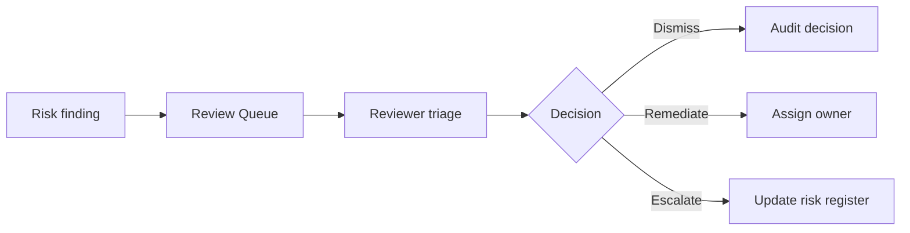

# Risk Register

This risk register documents the starting risk model for the platform. The database contains a `risk_register` table so these items can become application-managed records in later phases.

| ID | Risk | Impact | Likelihood | Mitigation | Owner |
| --- | --- | --- | --- | --- | --- |
| R-001 | Unauthorized access to restricted documents | High | Medium | Enforce backend RBAC and retrieval filters before vector search. | Security |
| R-002 | Prompt injection overrides system instructions | High | Medium | Detect suspicious prompts, refuse unsafe requests, log review items. | AI Governance |
| R-003 | PII exposure in uploaded documents | High | Medium | Scan documents before indexing, flag findings, limit log evidence. | Compliance |
| R-004 | Hallucinated answer without citations | Medium | Medium | Require grounded prompt, citations, confidence scoring, evaluation tests. | AI Engineering |
| R-005 | Excessive LLM spend | Medium | Medium | Track tokens and cost per user/department/model, add budget alerts. | Platform |
| R-006 | Stale or superseded policy document used in answer | Medium | Medium | Track document version, status, upload timestamp, and collection metadata. | Knowledge Owner |
| R-007 | Ingestion failure leaves documents unavailable | Medium | Medium | Track ingestion jobs, retries, errors, and admin visibility. | Platform |
| R-008 | Sensitive data duplicated into traces or logs | High | Low | Redact PII, use trace IDs, minimize snippets, configure retention. | Security |
| R-009 | Local fallback retrieval differs from provider-backed retrieval | Medium | Medium | Document local mode clearly and validate provider mode with evaluation suites before production use. | AI Engineering |

## Review Workflow

