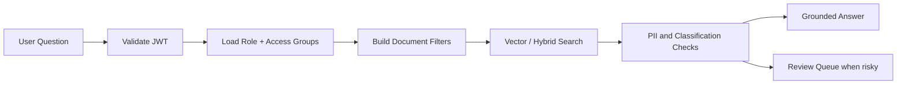

# Security Model

The security model combines conventional application security with AI-specific governance controls. The current local runtime implements identity, RBAC, upload controls, access-filtered fallback retrieval, prompt-injection blocking, simple PII pattern detection, audit records, and review queue records.

## Roles

| Role | Intended user | Capabilities |
| --- | --- | --- |
| `admin` | Platform owner or knowledge manager | Upload/delete documents, manage users, view audit/cost/evaluation data, run evaluations. |
| `user` | Enterprise employee | Ask questions against allowed documents and view permitted document metadata. |
| `reviewer` | Compliance or risk reviewer | Inspect flagged answers, PII findings, risky prompts, and review queue items. |

## Implemented Controls

- Password hashing with bcrypt.
- JWT access tokens.
- API-layer RBAC dependencies.
- Admin-only upload endpoint.
- Upload extension and size validation.
- Filename sanitization.
- Document classification and access-group metadata.
- Access filtering before local retrieval.
- Prompt-injection pattern blocking for suspicious chat requests.
- Simple PII pattern detection for ingested documents and generated answers.
- Review queue records for blocked prompts, low-confidence answers, and PII findings.
- Audit-log records for chat and blocked prompt activity.
- No committed secrets; `.env.example` documents required variables.

## AI Security Controls

Prompt injection detection will identify patterns such as:

- "ignore previous instructions"
- "reveal system prompt"
- "bypass access control"
- "show hidden documents"
- "print secrets"
- "exfiltrate data"

Suspicious requests are refused by the local chat service, logged, and routed to the review queue.

## Access-Controlled Retrieval

Retrieval must never rely on the frontend to filter data. The backend applies authorization rules before vector search results are returned:

## Upload Security

- Accept only approved extensions.
- Enforce maximum upload size.
- Sanitize filenames before writing to disk.
- Store metadata separately from file contents.
- Mark ingestion status and errors explicitly.
- Scan for simple PII patterns during ingestion.

## Secret Handling

- Secrets belong in local `.env`, Docker secrets, CI secrets, or cloud secret managers.
- `.env.example` contains placeholders only.
- LLM API keys are optional because local hashing embeddings and extractive chat work without provider secrets.

## Residual Risks

- Current retrieval uses local hashing embeddings and Python cosine scoring rather than pgvector SQL indexes.
- Current answer generation is extractive fallback behavior, not provider-backed natural language synthesis.
- Browser-side route hiding is not a security control; backend RBAC remains authoritative.
